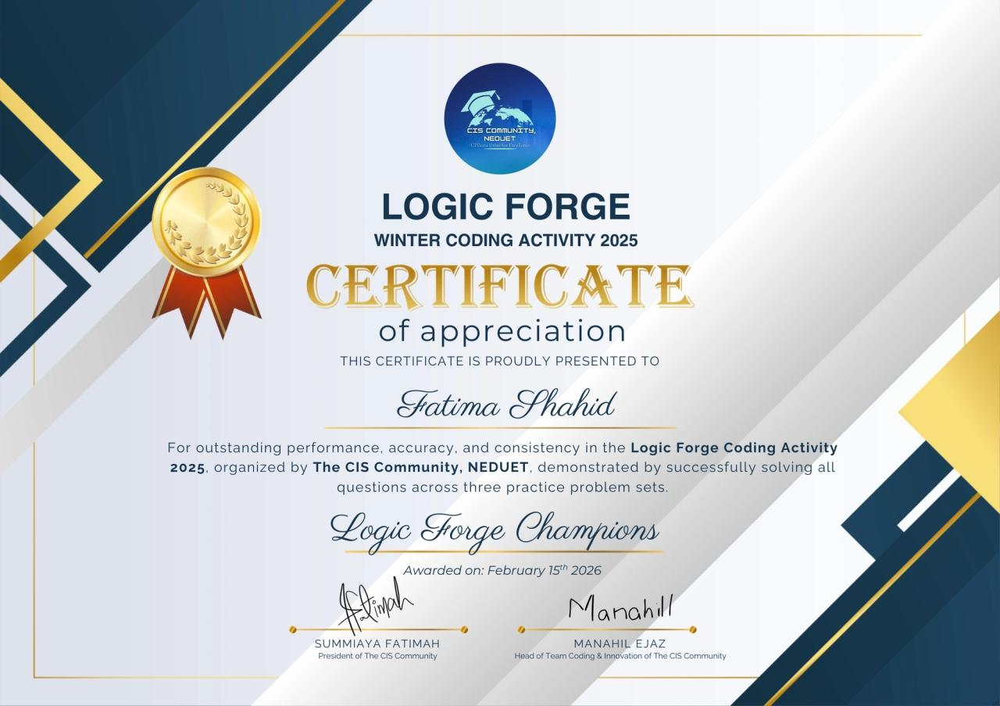
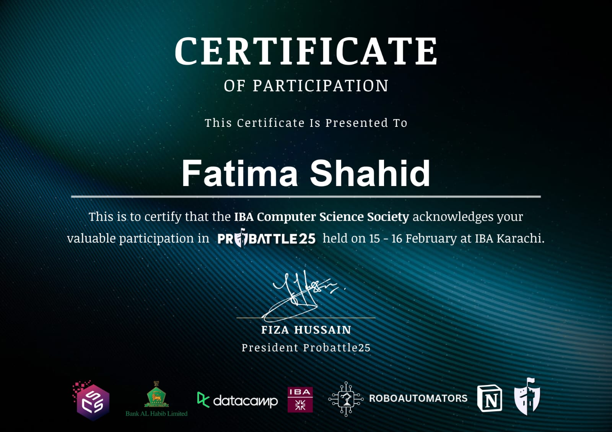
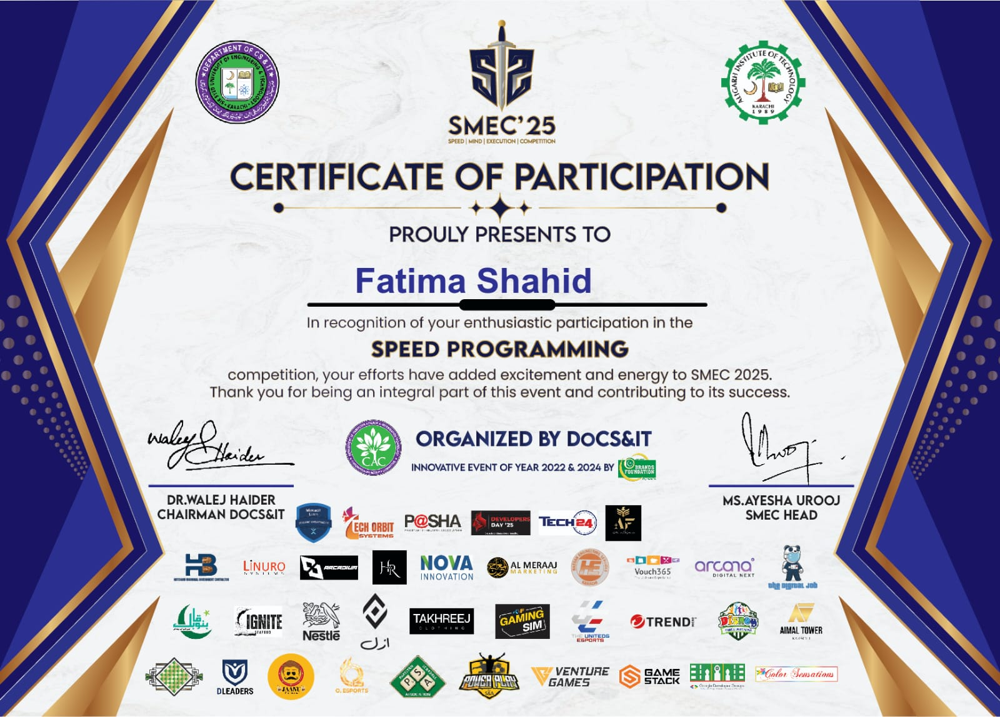
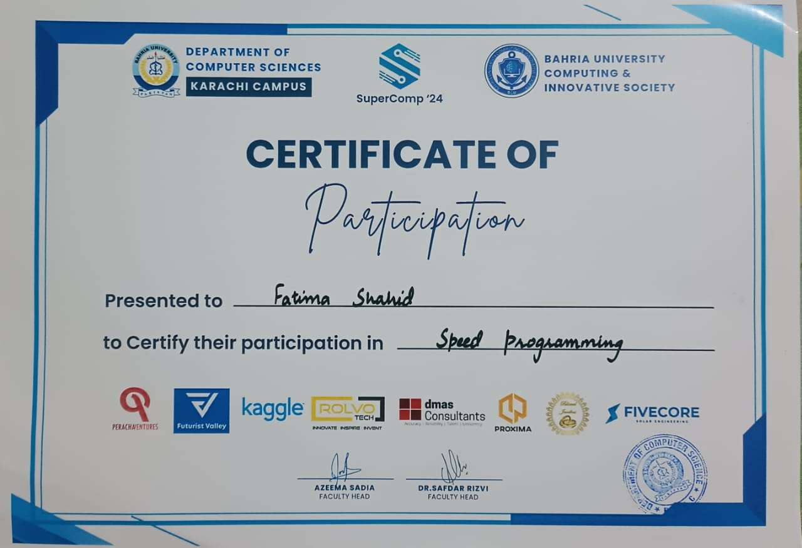
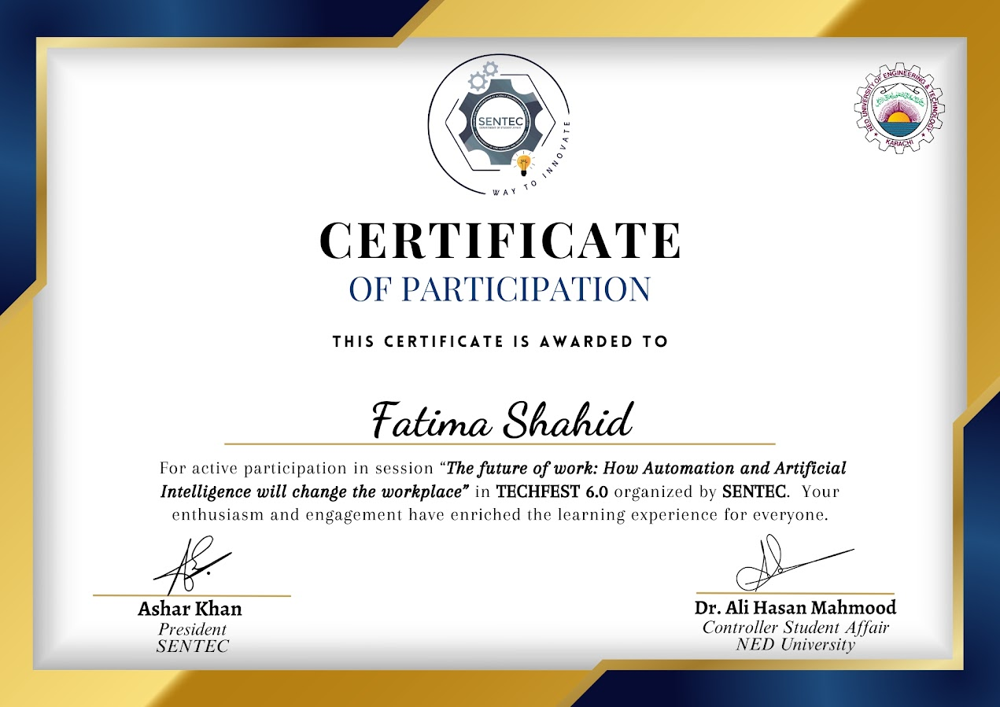
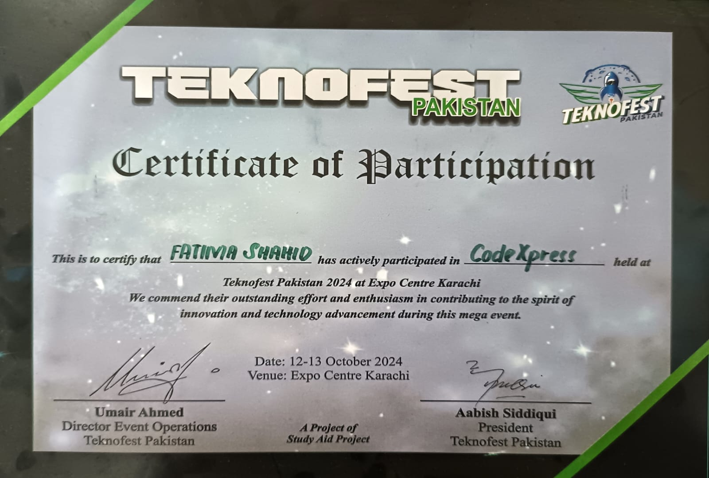

# 🧠 Coding Contests Repository  

> *“First, solve the problem. Then, write the code.”* — John Johnson  

Welcome to my collection of coding contest solutions 🚀  
This repository reflects my journey through problem-solving, logical thinking, and competitive programming.

---

## 🌟 Motivation Behind Participating in Coding Contests  

Coding contests are more than just competitions — they are a mindset.  
They push me to:
- Think under pressure  
- Break down complex problems  
- Continuously improve my algorithmic thinking  

Each contest is a step forward in becoming a better problem solver.

---

## 💡 Why Coding Contests Matter  

✨ **Sharpen Problem-Solving Skills**  
✨ **Enhance Logical Thinking**  
✨ **Prepare for Technical Interviews**  
✨ **Learn Time Management Under Pressure**  
✨ **Explore New Algorithms & Data Structures**  

> *“Competitive programming isn’t about being the best. It’s about being better than you were yesterday.”*

---

## 📂 Repository Structure  

### 🟣 Calico  
- `Calico_Spring_2026`

### 🔵 CIS Coders Arena  
- `CIS Coders Arena Summer Activity 2025`  
- `Winter Activity Logic Forge 2026`  

### 🟢 Meta Hacker Cup  
- Solutions from Meta Hacker Cup contests  

### 🟡 MIT  
- `M(IT)^2 2026 Spring Invitationals Qualification Round 1`  

### 🔴 Programmunity  
- `ProgrammunityPracticeContest0`  
- `ProgrammunityPracticeContest2`  
- `ProgrammunityPracticeContest3`  

### ⚫ SuperComp  
- `SuperComp24`  

---

## 🏆 Relevant Certificates  

Here are some of the certifications and recognitions I’ve earned through my participation in coding contests and problem-solving activities:

  
  
  
  
  
  
  

---

## 📬 Connect With Me  

💼 **LinkedIn:** https://www.linkedin.com/in/fatima-shahid-46723429a/  
💻 **LeetCode:** https://leetcode.com/u/FatimaaShahid/  
✍️ **Medium:** https://medium.com/@fatimashahid781  
📧 **Email:** fatimashahid781@gmail.com  
📸 **Instagram:** https://www.instagram.com/fatimas_abstract  

---

## 🌱 Final Note  

This repository is not just a collection of solutions —  
it’s a reflection of consistency, curiosity, and growth.  

> *“Every solved problem is a small victory.”* 🏆  

---
